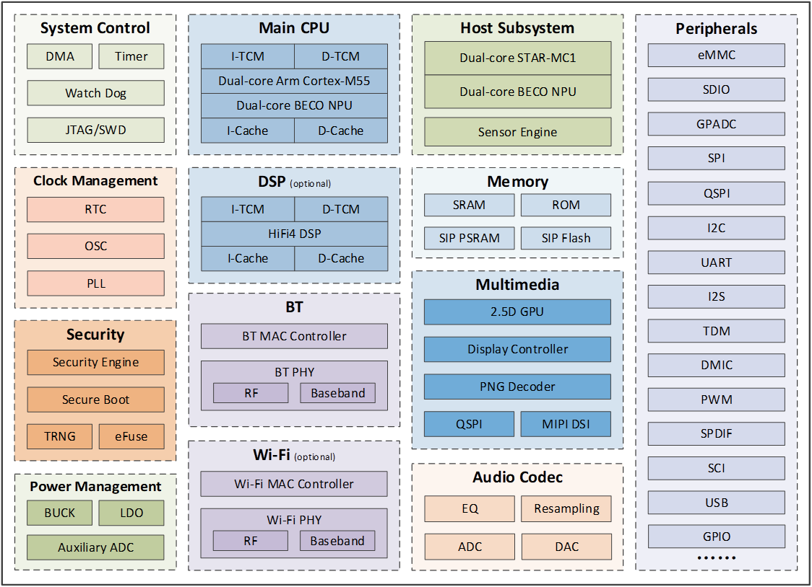
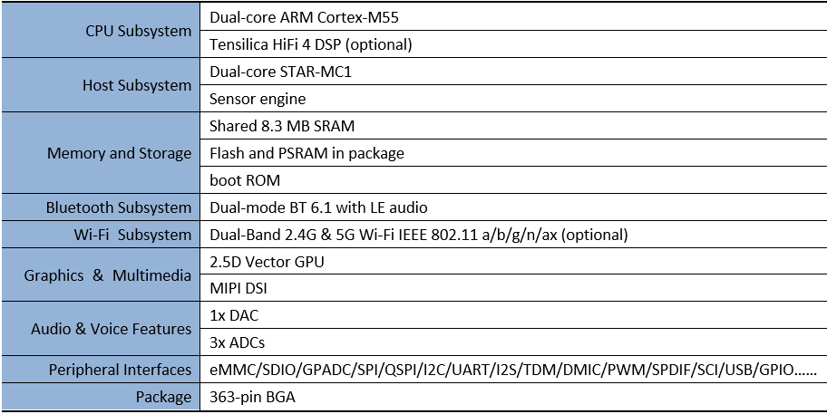

# BES2800BP

:::info
Source: https://www.bestechnic.com/article/71/55.html

Translated by: ChatGPT AI
:::

**总体描述**

BES2800BP 是一款超低功耗、高性能的智能穿戴 SoC，集成了蓝牙和可选的 Wi-Fi 功能。该平台内置强大的 CPU 子系统，包括双核 Arm Cortex-M55 处理器、双核 BECO NPU、用于高级信号处理和神经网络工作负载的 BES 专有协处理器、可选的 Tensilica HiFi 4 DSP、音频编解码子系统，以及由双核 STAR-MC1 处理器和双核 BECO NPU 组成的主机子系统。这样的组合在提供强大应用处理能力的同时，显著降低了功耗。

该平台集成了双模 Bluetooth 6.1 子系统，支持经典蓝牙和 LE Audio，同时还集成了 Wi-Fi 6 子系统，可提供高吞吐量的无线连接能力。此外，它还集成了多媒体子系统，包括用于高级图形处理的 2.5D GPU、支持最多 3 层 Alpha 混合的 LCD 控制器，以及 4 通道或双 2 通道 MIPI DSI，最高支持 720p、24bpp 分辨率。

系统框图

功能特性/技术规格

*本表内容可能会随时变更，恕不另行通知。